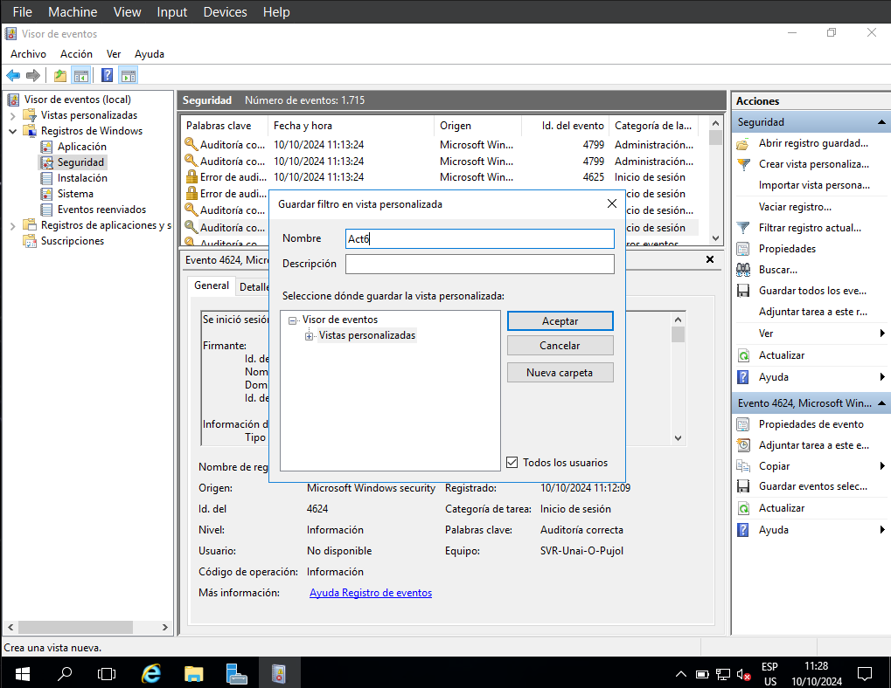

# 1. Create a custom view.
#### First we need to open the Server Manager.

#### Now click on tools, and then event viewer.

#### In this case I will use event 4624 (a user logging in successfully). We will head to Windows Register and then security.


#### Now we click "Create custom view".

#### In "Every event id." we type our event id (in this case 4624). After clicking "Accept" Windows will prompt us to name the view (I'll name it Act6).

#### Click Accept and the custom view will pop up. It will show every 4624.
# 2. Create a task.
### First click on "Attach a file to this view", then "next", next "again".

### Here we choose the action that will be performed by Windows after a 4624, in this case I will choose the option "Start a program". I want to open the Powershell.

`C:\\Windows\System32\WindowsPowerShell\v1.0\powershell.exe`
### After clicking "next", click "finish".
# 3. Export the custom view as XML.
### Right click Act6 and then click "Export custom view", name the file and save it where you desire.

```
<ViewerConfig>
  <QueryConfig>
    <QueryParams>
      <Simple>
        <Channel>Security</Channel>
        <EventId>4624</EventId>
        <RelativeTimeInfo>0</RelativeTimeInfo>
        <BySource>False</BySource>
      </Simple>
    </QueryParams>
    <QueryNode>
      <Name LanguageNeutralValue="Act6">Act6</Name>
      <QueryList>
        <Query Id="0" Path="Security">
          <Select Path="Security">*[System[(EventID=4624)]]</Select>
        </Query>
      </QueryList>
    </QueryNode>
  </QueryConfig>
  <ResultsConfig>
    <Columns>
      <Column Name="Nivel" Type="System.String" Path="Event/System/Level" Visible="">134</Column>
      <Column Name="Palabras clave" Type="System.String" Path="Event/System/Keywords">70</Column>
      <Column Name="Fecha y hora" Type="System.DateTime" Path="Event/System/TimeCreated/@SystemTime" Visible="">184</Column>
      <Column Name="Origen" Type="System.String" Path="Event/System/Provider/@Name" Visible="">94</Column>
      <Column Name="Id. del evento" Type="System.UInt32" Path="Event/System/EventID" Visible="">94</Column>
      <Column Name="Categoría de la tarea" Type="System.String" Path="Event/System/Task" Visible="">94</Column>
      <Column Name="Usuario" Type="System.String" Path="Event/System/Security/@UserID">50</Column>
      <Column Name="Código operativo" Type="System.String" Path="Event/System/Opcode">110</Column>
      <Column Name="Registro" Type="System.String" Path="Event/System/Channel">80</Column>
      <Column Name="Equipo" Type="System.String" Path="Event/System/Computer">170</Column>
      <Column Name="Id. de proceso" Type="System.UInt32" Path="Event/System/Execution/@ProcessID">70</Column>
      <Column Name="Id. de subproceso" Type="System.UInt32" Path="Event/System/Execution/@ThreadID">70</Column>
      <Column Name="Id. de procesador" Type="System.UInt32" Path="Event/System/Execution/@ProcessorID">90</Column>
      <Column Name="Id. de sesión" Type="System.UInt32" Path="Event/System/Execution/@SessionID">70</Column>
      <Column Name="Tiempo de kernel" Type="System.UInt32" Path="Event/System/Execution/@KernelTime">80</Column>
      <Column Name="Tiempo de usuario" Type="System.UInt32" Path="Event/System/Execution/@UserTime">70</Column>
      <Column Name="Tiempo de procesador" Type="System.UInt32" Path="Event/System/Execution/@ProcessorTime">100</Column>
      <Column Name="Id. de correlación" Type="System.Guid" Path="Event/System/Correlation/@ActivityID">85</Column>
      <Column Name="Id. de correlación relativa" Type="System.Guid" Path="Event/System/Correlation/@RelatedActivityID">140</Column>
      <Column Name="Nombre de origen de evento" Type="System.String" Path="Event/System/Provider/@EventSourceName">140</Column>
    </Columns>
  </ResultsConfig>
</ViewerConfig>

```
# 4. Import the custom view on a different VM.

### Now just choose the XML file.