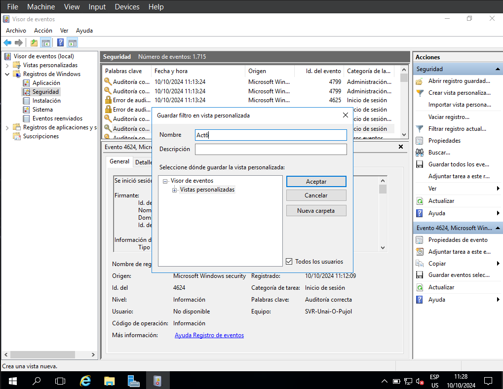

# 1. Create a custom view.
#### First we need to open the Server Manager.
![[1.png]]
#### Now click on tools, and then event viewer.\
![[2.png]]
#### In this case I will use event 4624 (a user logging in successfully). We will head to Windows Register and then security.
![[3.png]]
#### Now we click "Create custom view".
![[4.png]]
#### In "Every event id." we type our event id (in this case 4624). After clicking Accept Windows will prompt us to name the view (I'll name it Act6).

#### Click Accept and the custom view will pop up. It will show every 4624.
# 2. Create a task.

