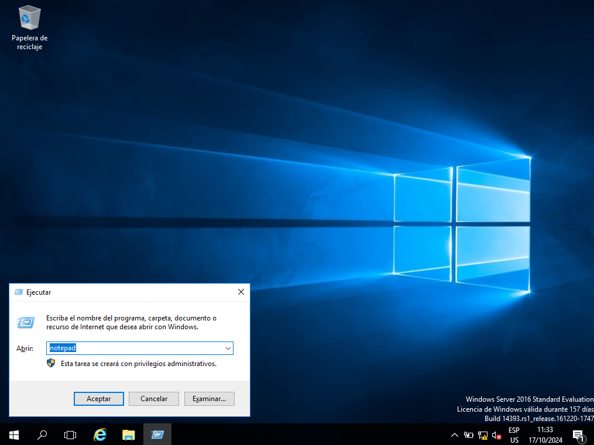
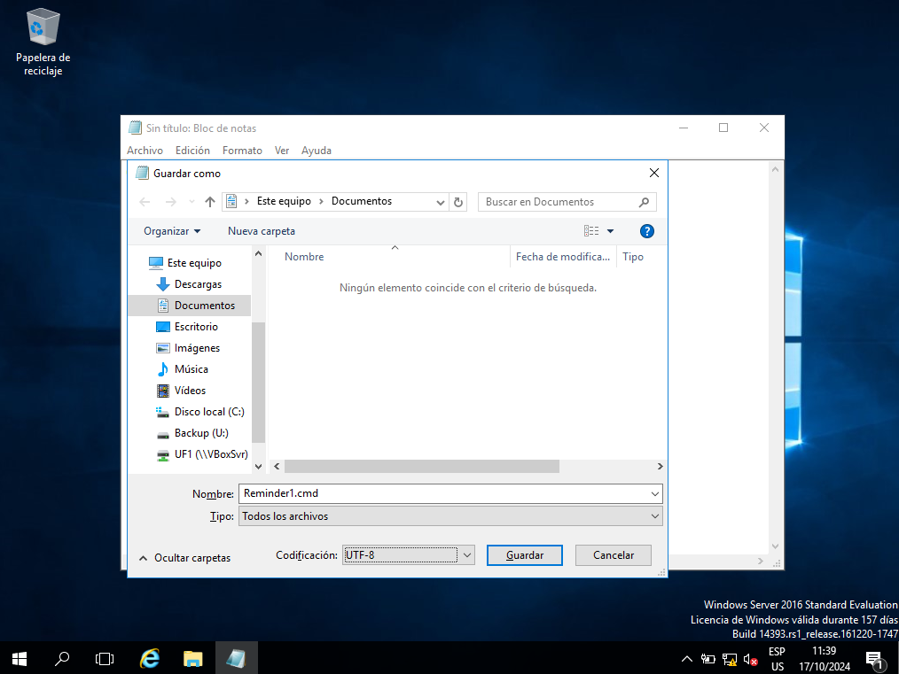
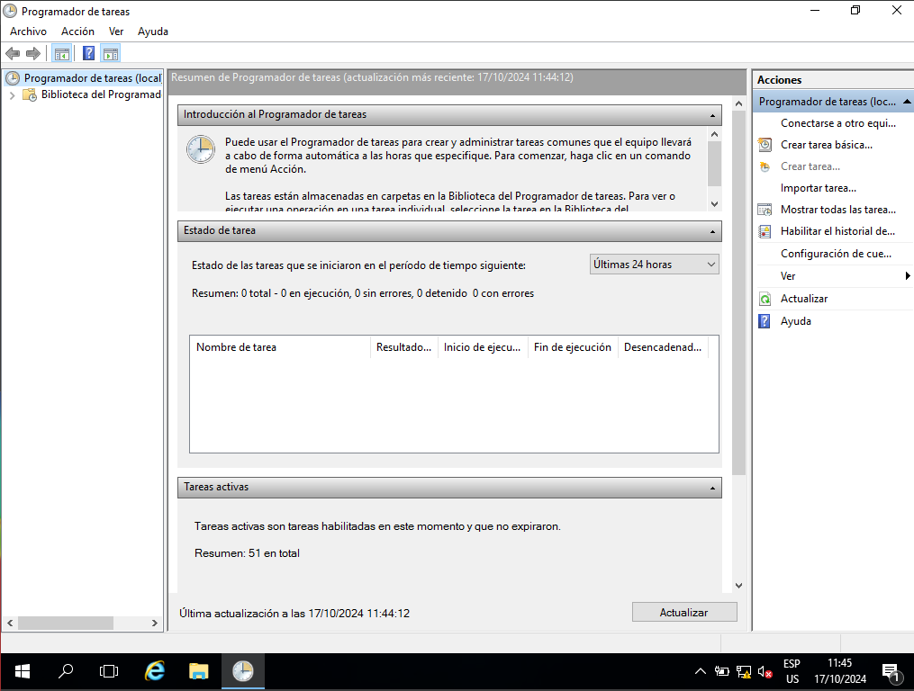
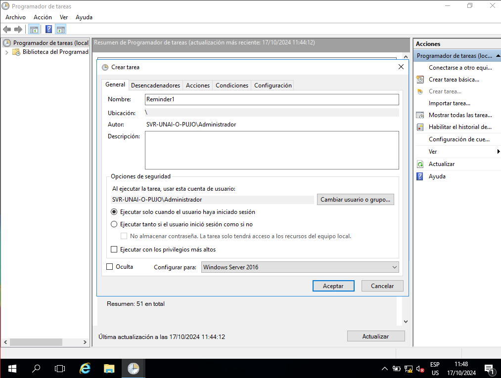
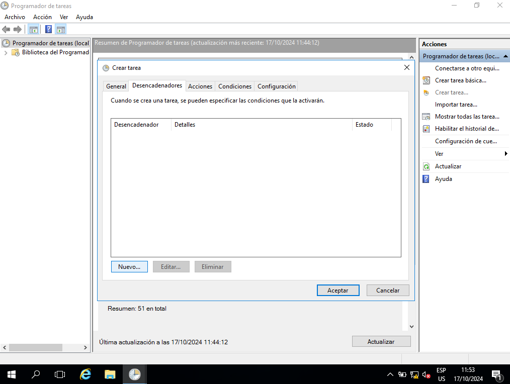
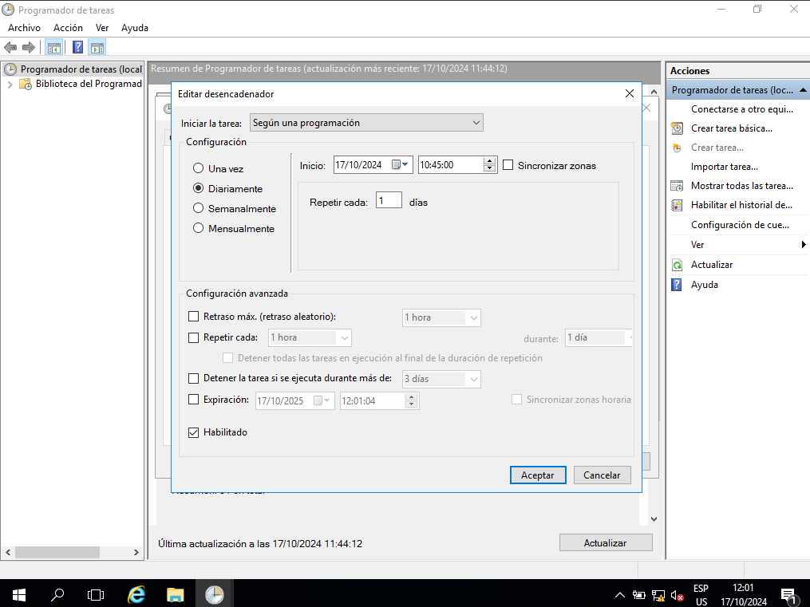
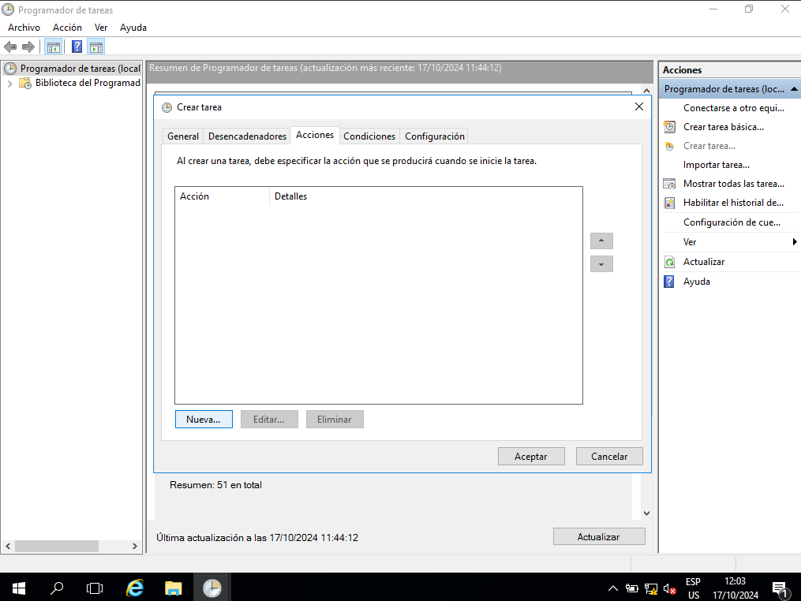
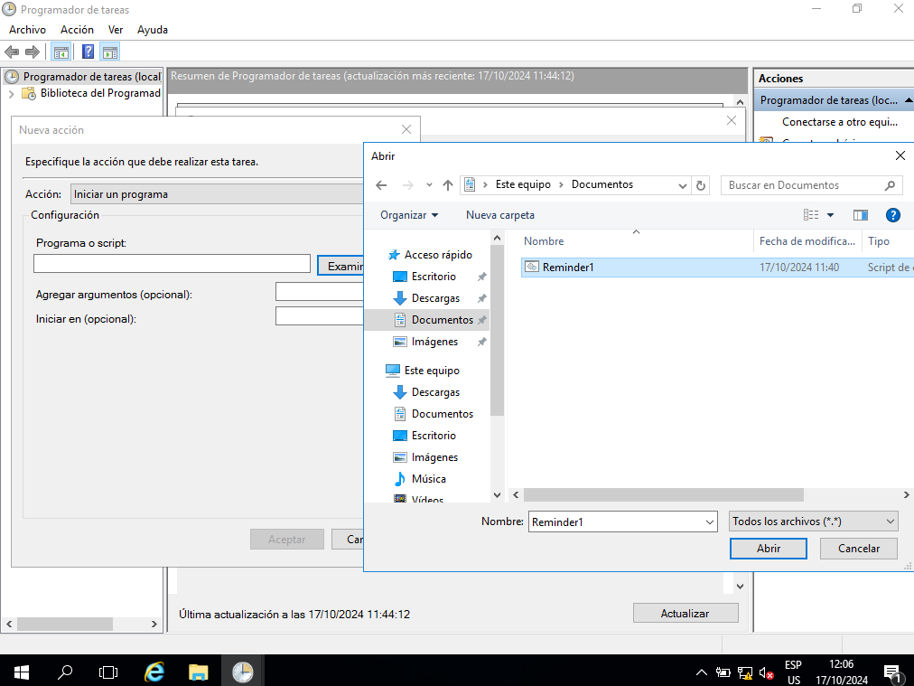

# Task Scheduler.
## A. Set a Reminder.
### 1. Making the file.
We can create the file in notepad by clicking Win Key + R, the run menu will open and we can type notepad.

At this point we will have a blank file.
### 2. Structure/Content.
The structure of the file is the following:
```
@echo off
title NameofReminder
echo ReminderMessage
pause
```
In this case, I want to remember to switch to linux, and I want to name it Upgrade. It would look like this:
```
@echo off
title Update
echo Switch to Linux
pause
```
Now we type the content in the file.
### 3. Saving the file.
We save the file by clicking Ctrl + S, we name the file something like Reminder1 and change the fromat to .cmd and click "Save":

### 4. Task Scheduler.
We open task scheduler. Once it's open we click "Create Task".

We name it (in this case Reminder1) and click "Configure for:" and select Windows Server 2016.

Now switch to the "Triggers" tab and click "New".

I will select the configuration to "Daily" and se the time to "10:45:00" and click "Ok".

Now switch to "Action" tab and click "New". 

Now click in "Browse" and select the `Reminder1.cmd`.

Now click "Open", "Ok" and click "Ok". When the reminder triggers at the chosen time, the reminder will show in the CMD.
## B. Setup System Restart.
### Structure/Content.
```

```