# 1. Install Ubuntu Desktop
## a) [[VirtualBox]]
Once [[VirtualBox]] is open, click on "New".
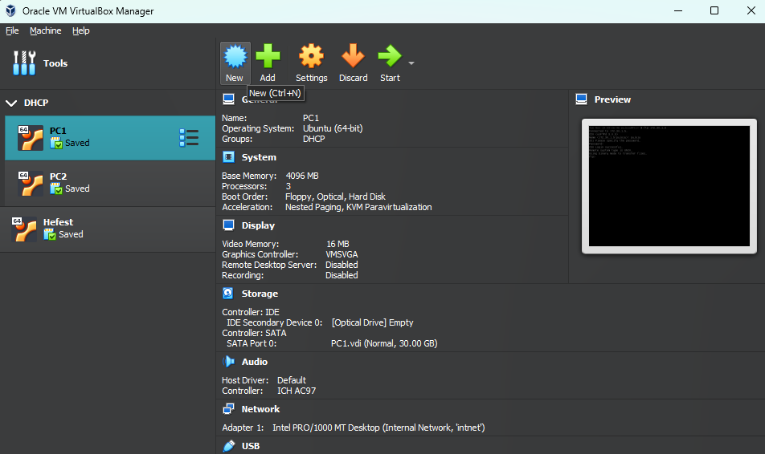

You will be prompted with a widow to set the preperties and settings of the [[VM]], in the "Name and Operating System", fill the info (you don't need to copy this exactly, but take it as some guidance):
- Name: M4_Ubuntu_Desktop
- Folder: C:\\User\VM_Folder
- ISO Image: C:\\User\ubuntu-desktop.iso
- Type: Linux
- Version: Ubuntu (64-bit)

Also select the box next to "Skip Unattended Installation".
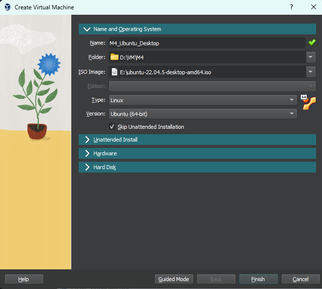

Now to the "Hardware" section:
- RAM: 4096 MB
- Cores/CPUs: 2

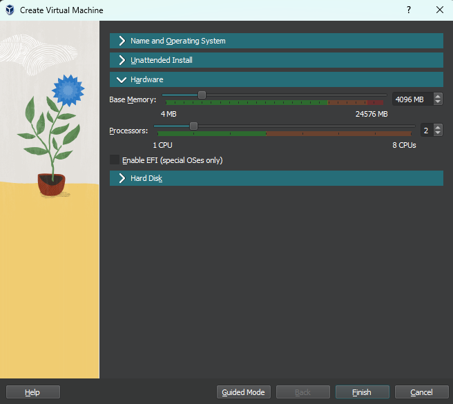

Last, "Hard Disk":
- Hard Disk File Location: C:\\User\VM_Folderm4_ubuntu_desktop.vdi
- Hard Disk File Size: 50 GB

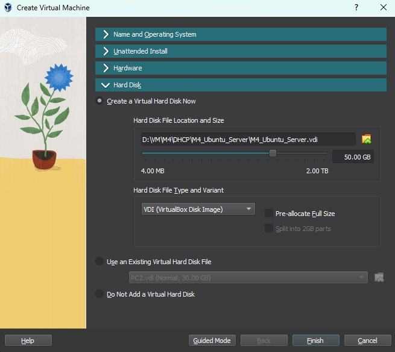

Now click "Finish", you may now click "Start".
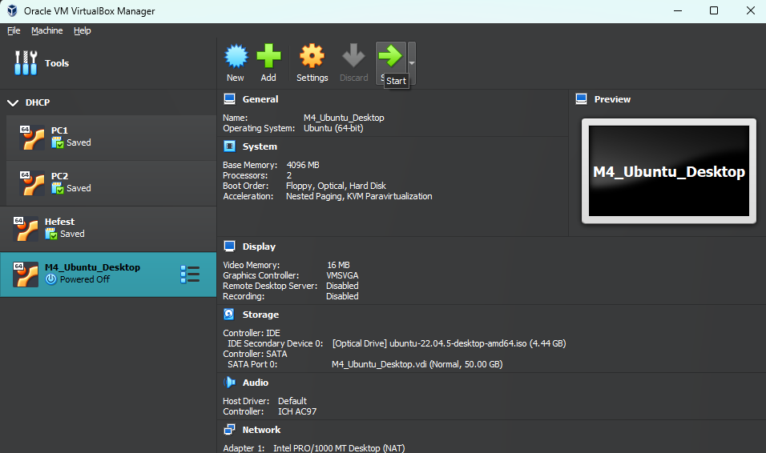
## b) Ubuntu Installer
When the [[VM]] powers up, Ubuntu will prompt you. By default "Try or Install Ubuntu" will be selected, press enter.
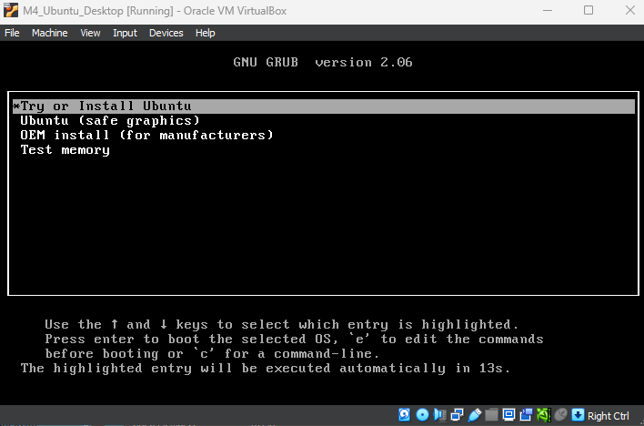

After waiting, Ubuntu will prompt you again to either try or install the OS, select your language and cilck on "Install Ubuntu".
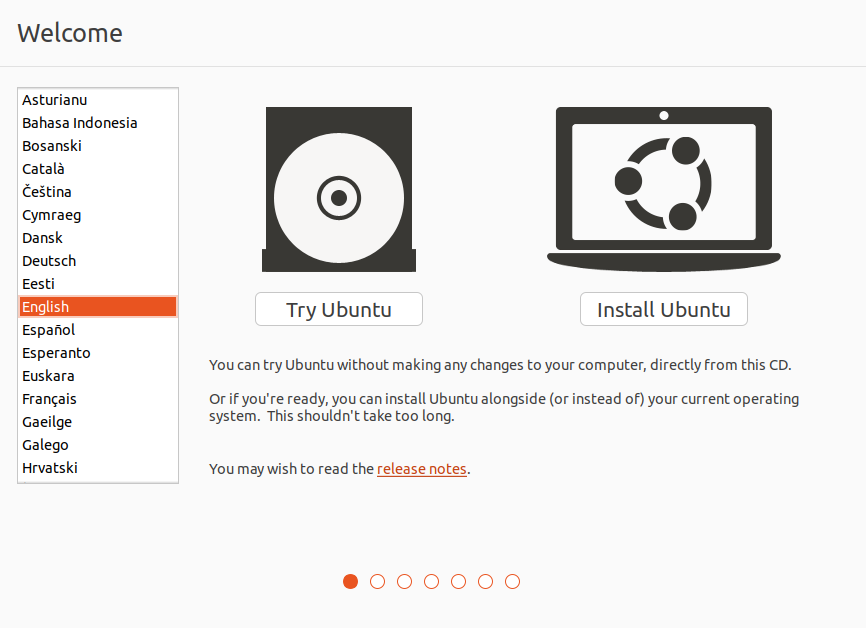

Now select your keyboard layout and click "Continue".
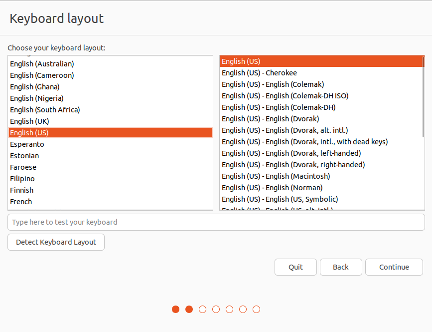

On "What apps would you like to start with?" select "Minimal installation" to have less useless apps out of the box, click "Continue".
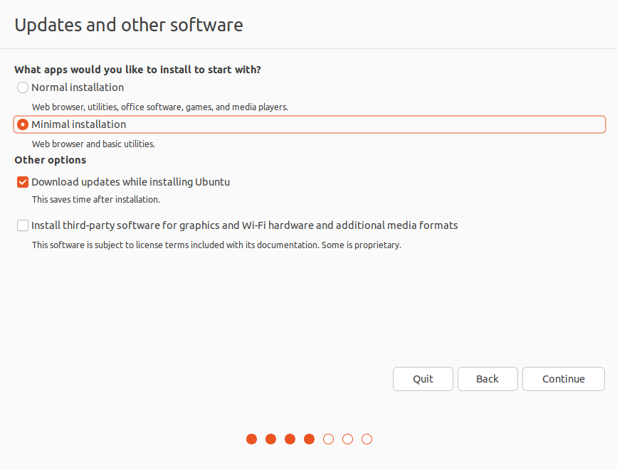

Click on "Install Now" that will format the drive and install Ubuntu on the entire drive.
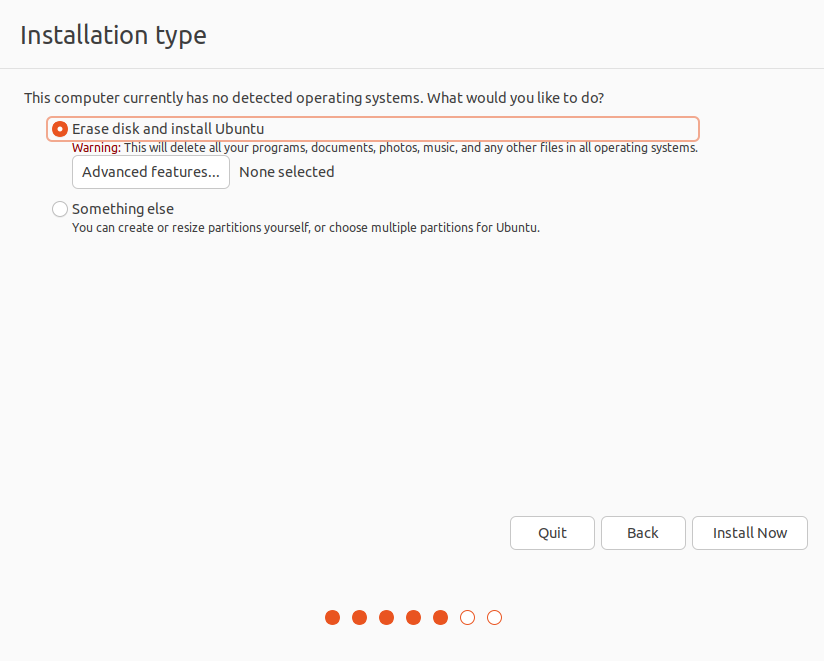

Click "Continue" to cofirm.
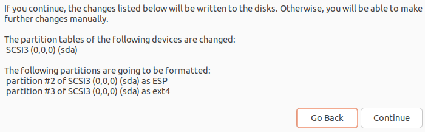

It takes us to the "Where are you" section, select your region and click "Continue.
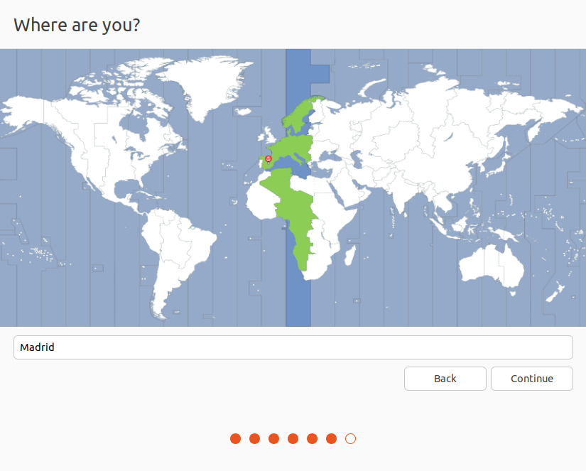

Now fill all of the name and login text boxes and click "Continue".
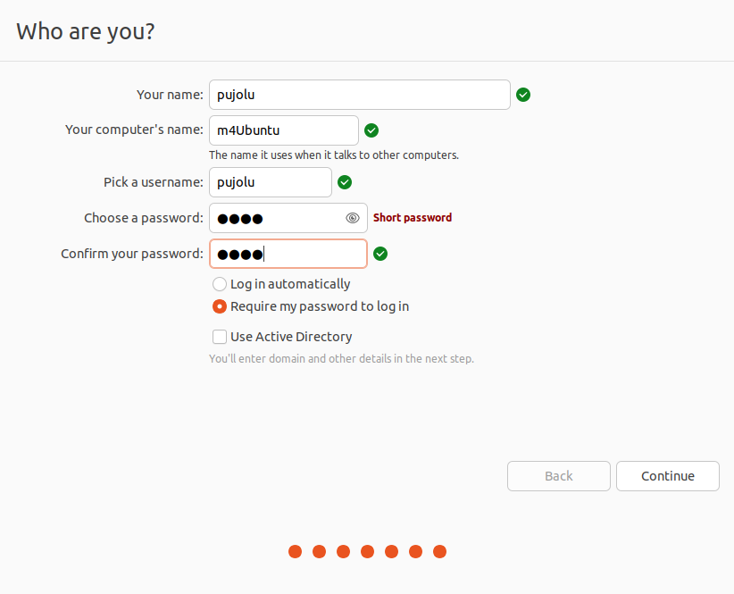

Now, we wait......
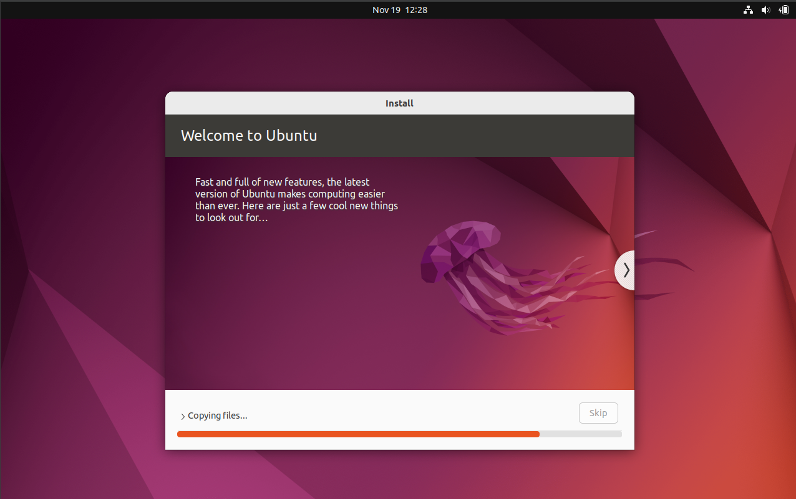

Once you have waited, you can click "Restart Now" and remove the iso.
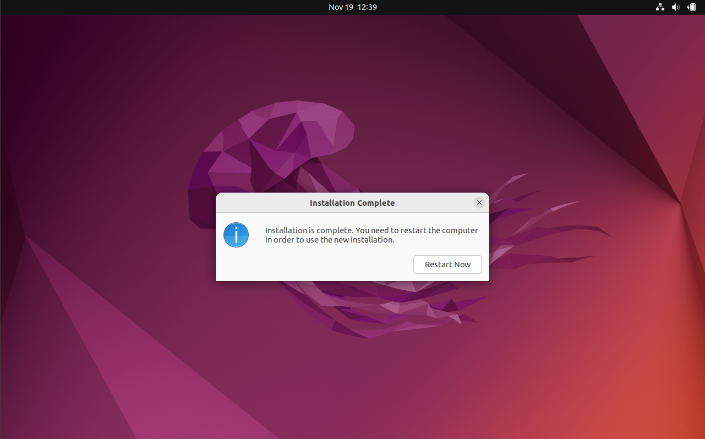

# 2. Guest Additions
## a) [[VirtualBox]]
Now with the VM on, click on the "Devices" tab at the top of the window of the VM. In this menu click "Insert Guest Additions CD image..."
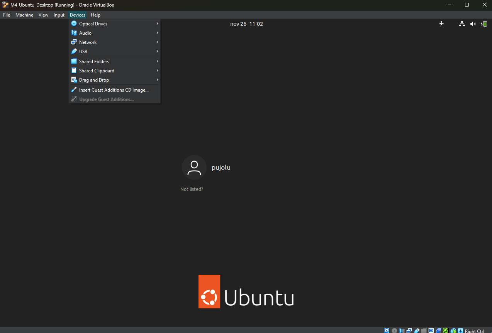

## b) Ubuntu
Now in Ubuntu we open the Guest Additions Image from the dock in the left.
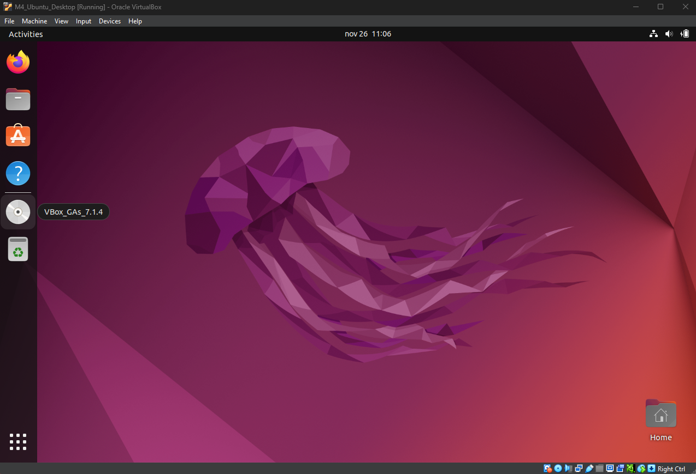

Now you need to find the file `Autorun.sh`, once you have. Right click on the file and click "Run as a Program"
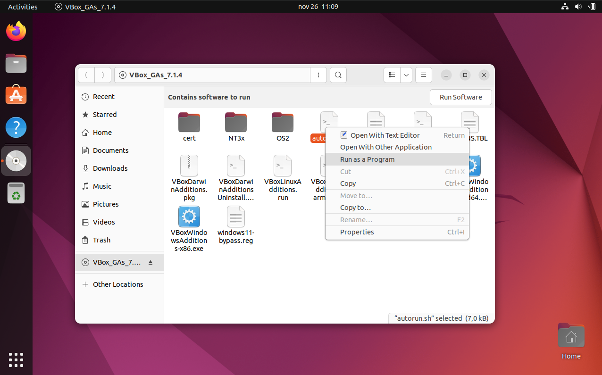

Now Ubuntu will prompt you to insert your password to execute the script.
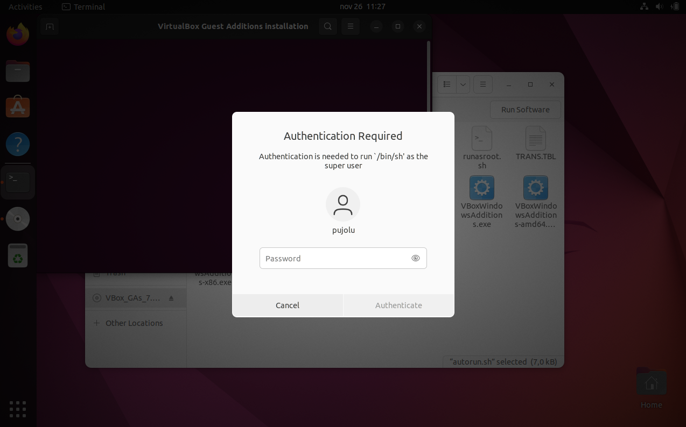

Now eject the Guest Additions CD.
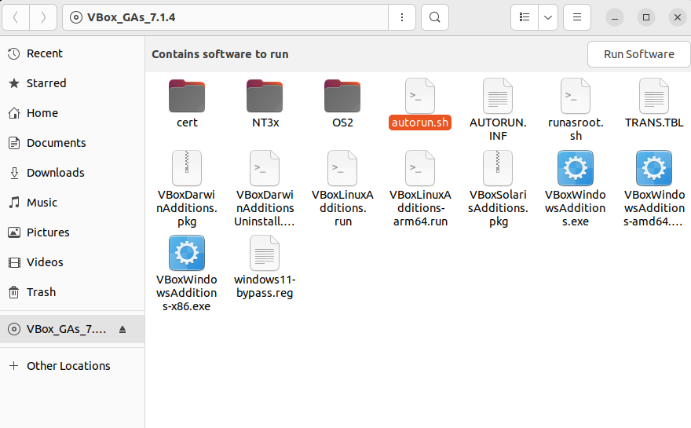

