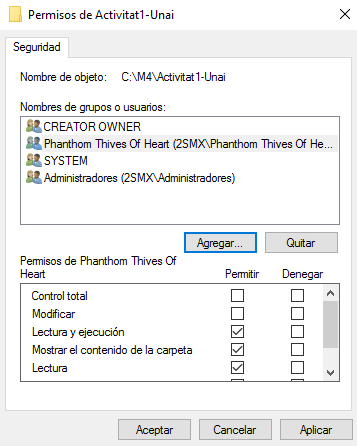

# 1. Preparació de l’entorn:
## a) Crea tres carpetes compartides en el servidor amb els noms: Activitat1-X, Activitat2-X i Activitat3-X.

## b) Crea 3 usuaris amb els noms que vulguis i 2 grups al teu servidor.

## c) Assigna permisos específics a cada carpeta per diferents usuaris o grups.

# 2. Connexió a Recursos compartits:
## a) Utilitza net use per connectar a cada carpeta compartida amb diferents lletres de unitat (G:, H: i I:) sense fer-les persistents.

# 3. Gestió de connexions:
## a) Desconnecta una de les unitats per comanda.

# 4. Utilització de Credencials:
## a) Connecta el recurs a la lletra M: amb credencials d’un usuari.

## b) Desconnecta una unitat que tingui l’accés per a un usuari limitat. Connecta’l a la lletra P: amb les credencials d’aquest usuari. Què ocorre si intentes accedir als recursos sense els permisos adequats?

# 5. Neteja de l’entorn:
## a) Desconnecta totes les unitats de xarxa creades durant l’activitat.

## b) Elimina les carpetes compartides.
